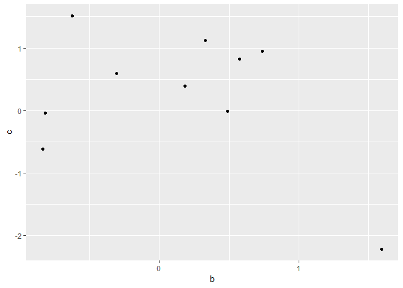

Hello\_World1
================
bolta
February 13, 2019

``` r
library(tidyverse)
```

    ## -- Attaching packages ------------------------------------------------------------------------------------------------------------------------------------- tidyverse 1.2.1 --

    ## v ggplot2 3.1.0     v purrr   0.3.0
    ## v tibble  2.0.1     v dplyr   0.7.8
    ## v tidyr   0.8.2     v stringr 1.3.1
    ## v readr   1.2.1     v forcats 0.3.0

    ## -- Conflicts ---------------------------------------------------------------------------------------------------------------------------------------- tidyverse_conflicts() --
    ## x dplyr::filter() masks stats::filter()
    ## x dplyr::lag()    masks stats::lag()

``` r
set.seed(1)
df = tibble(a = 1:10,
            b = rnorm(10),
            c = rnorm(10))

df %>% 
  ggplot(aes(b, c)) +
  geom_point()
```


