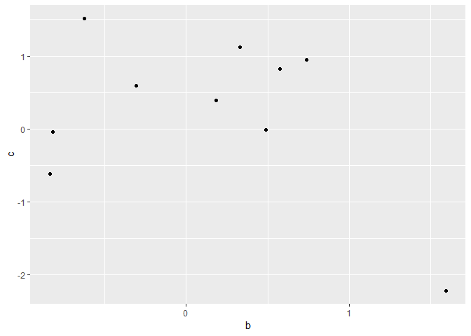

Tidy eval and dplyr/tidyverse examples
======================================

#### A growing gallery of tidy NSE

#### Because of scoping, this will also include the dplyr "<operation>\_at" functions

Helpful links
-------------

The 2 iterations of Hadley's advanced R <br><http://adv-r.had.co.nz/> <br><https://adv-r.hadley.nz/>

The programming dplyr article <br><https://dplyr.tidyverse.org/articles/programming.html>

``` r
library(tidyverse)
```

    ## -- Attaching packages ------------------------------------------------------------------------------------------------------------------------------------- tidyverse 1.2.1 --

    ## v ggplot2 3.1.0     v purrr   0.3.0
    ## v tibble  2.0.1     v dplyr   0.7.8
    ## v tidyr   0.8.2     v stringr 1.3.1
    ## v readr   1.2.1     v forcats 0.3.0

    ## -- Conflicts ---------------------------------------------------------------------------------------------------------------------------------------- tidyverse_conflicts() --
    ## x dplyr::filter() masks stats::filter()
    ## x dplyr::lag()    masks stats::lag()

``` r
library(ggvis)
```

    ## 
    ## Attaching package: 'ggvis'

    ## The following object is masked from 'package:ggplot2':
    ## 
    ##     resolution

### Compare multiple quosures

``` r
### These are not the same
quos(B, C, D) %>% 
  class()
```

    ## [1] "quosures"

``` r
list(quo(A), quo(B), quo(C)) %>% 
  class()
```

    ## [1] "list"

``` r
## Fails
# list(A, B, C)
```

### Create a tibble

#### 1. Single column, outside of function

``` r
num_rows = 8

col_names = quo(A) %>% 
  quo_name()

tibble(!! col_names := rnorm(num_rows))
```

    ## # A tibble: 8 x 1
    ##          A
    ##      <dbl>
    ## 1  0.165  
    ## 2  0.308  
    ## 3  0.594  
    ## 4 -0.721  
    ## 5  0.263  
    ## 6  0.638  
    ## 7  0.666  
    ## 8 -0.00216

#### 2. Multiple columns

Use map and quo\_name

``` r
col_names = quos(A, B, C, D) %>% 
  map(function(expr) quo_name(expr))

col_names %>% 
  map(function(col_name) tibble(!! col_name := rnorm(4))) %>% 
  bind_cols()
```

    ## # A tibble: 4 x 4
    ##         A      B      C      D
    ##     <dbl>  <dbl>  <dbl>  <dbl>
    ## 1 0.0652  -0.556  0.221 -1.64 
    ## 2 1.44    -0.927 -1.12   2.32 
    ## 3 1.05    -0.166  0.748  1.08 
    ## 4 0.00694  0.848  0.690 -0.444

#### 2. Multiple columns without quo\_name

``` r
quos(A, B, C) %>% 
  map(function(col_name) tibble(!! col_name := rnorm(3))) %>% 
  bind_cols()
```

    ## # A tibble: 3 x 3
    ##        A      B       C
    ##    <dbl>  <dbl>   <dbl>
    ## 1  0.379  0.762 -0.0830
    ## 2 -0.766  0.386  2.52  
    ## 3  0.959 -0.582 -0.157

#### 4. In a function using ...

``` r
create_tibble1 = function(col_names_f, num_rows_f = 100, ...){
  col_names_f = enquos(col_names_f, ...) %>% 
    map(function(expr) quo_name(expr))
  
  col_names_f %>%
    map(function(col_name) tibble(!! col_name := rnorm(num_rows_f))) %>% 
    bind_cols()
}

create_tibble1(col_names_f = B, C, D, E, num_rows_f = 6)
```

    ## # A tibble: 6 x 4
    ##         B      C      D      E
    ##     <dbl>  <dbl>  <dbl>  <dbl>
    ## 1  1.84    0.533  0.395 -0.328
    ## 2  0.0680  0.526 -0.685 -0.170
    ## 3  0.160  -1.04  -1.01  -0.698
    ## 4  0.418  -0.148  0.236 -0.659
    ## 5 -0.115   1.94   1.68  -1.95 
    ## 6 -0.641   0.163  1.08  -0.794

#### 5. In a function not using ...

``` r
create_tibble2 = function(col_names_f, num_rows_f = 100){
  col_names_f = col_names_f %>% 
    map(function(expr) quo_name(expr))
  
  col_names_f %>%
    map(function(col_name) tibble(!! col_name := rnorm(num_rows_f))) %>% 
    bind_cols()
}

create_tibble2(col_names_f = quos(B, C, D, E), num_rows_f = 10)
```

    ## # A tibble: 10 x 4
    ##          B      C       D       E
    ##      <dbl>  <dbl>   <dbl>   <dbl>
    ##  1 -0.169   0.419  0.576   0.331 
    ##  2  0.816  -0.932 -0.451   0.902 
    ##  3 -0.587   0.474 -0.503   0.578 
    ##  4  0.375   0.665  0.697  -0.306 
    ##  5  1.16    0.899  0.353   0.694 
    ##  6 -1.96    0.968  1.44    0.0870
    ##  7  0.410   2.30   0.0717  1.44  
    ##  8  0.0497  0.364  0.333  -0.762 
    ##  9 -0.0279 -0.791 -0.387  -1.17  
    ## 10 -0.244  -0.609 -0.217   0.318

### Group\_by\_at

``` r
tibble(col1 = c("A", "B", "C") %>% 
         sample(size = 100, replace = TRUE)) %>% 
  group_by_at(names(.)) %>% 
  summarise(n = n())
```

    ## # A tibble: 3 x 2
    ##   col1      n
    ##   <chr> <int>
    ## 1 A        35
    ## 2 B        33
    ## 3 C        32

### Graph examples

#### ggvis, which uses formulas

``` r
set.seed(1)
df = tibble(a = 1:10,
            b = rnorm(10),
            c = rnorm(10))

# df %>% 
#   ggvis(~b, ~c) %>% layer_points()

ggvis_sample = function(data, col1, col2){
  col1 = enquo(col1)
  col2 = enquo(col2)
  data %>% 
    ggvis(col1, col2) %>% layer_points()
}

ggvis_sample(df, b, c)
```

<!--html_preserve-->

<nav class="ggvis-control"> <a class="ggvis-dropdown-toggle" title="Controls" onclick="return false;"></a>
<ul class="ggvis-dropdown">
<li>
Renderer: <a id="plot_id838851663_renderer_svg" class="ggvis-renderer-button" onclick="return false;" data-plot-id="plot_id838851663" data-renderer="svg">SVG</a> | <a id="plot_id838851663_renderer_canvas" class="ggvis-renderer-button" onclick="return false;" data-plot-id="plot_id838851663" data-renderer="canvas">Canvas</a>
</li>
<li>
<a id="plot_id838851663_download" class="ggvis-download" data-plot-id="plot_id838851663">Download</a>
</li>
</ul>
</nav>

<script type="text/javascript">
var plot_id838851663_spec = {
  "data": [
    {
      "name": ".0",
      "format": {
        "type": "csv",
        "parse": {
          "b": "number",
          "c": "number"
        }
      },
      "values": "\"b\",\"c\"\n-0.626453810742332,1.51178116845085\n0.183643324222082,0.389843236411431\n-0.835628612410047,-0.621240580541804\n1.59528080213779,-2.2146998871775\n0.329507771815361,1.12493091814311\n-0.820468384118015,-0.0449336090152309\n0.487429052428485,-0.0161902630989461\n0.738324705129217,0.943836210685299\n0.575781351653492,0.821221195098089\n-0.305388387156356,0.593901321217509"
    },
    {
      "name": "scale/x",
      "format": {
        "type": "csv",
        "parse": {
          "domain": "number"
        }
      },
      "values": "\"domain\"\n-0.957174083137439\n1.71682627286518"
    },
    {
      "name": "scale/y",
      "format": {
        "type": "csv",
        "parse": {
          "domain": "number"
        }
      },
      "values": "\"domain\"\n-2.40102393995892\n1.69810522123227"
    }
  ],
  "scales": [
    {
      "name": "x",
      "domain": {
        "data": "scale/x",
        "field": "data.domain"
      },
      "zero": false,
      "nice": false,
      "clamp": false,
      "range": "width"
    },
    {
      "name": "y",
      "domain": {
        "data": "scale/y",
        "field": "data.domain"
      },
      "zero": false,
      "nice": false,
      "clamp": false,
      "range": "height"
    }
  ],
  "marks": [
    {
      "type": "symbol",
      "properties": {
        "update": {
          "fill": {
            "value": "#000000"
          },
          "size": {
            "value": 50
          },
          "x": {
            "scale": "x",
            "field": "data.b"
          },
          "y": {
            "scale": "y",
            "field": "data.c"
          }
        },
        "ggvis": {
          "data": {
            "value": ".0"
          }
        }
      },
      "from": {
        "data": ".0"
      }
    }
  ],
  "legends": [],
  "axes": [
    {
      "type": "x",
      "scale": "x",
      "orient": "bottom",
      "layer": "back",
      "grid": true,
      "title": "b"
    },
    {
      "type": "y",
      "scale": "y",
      "orient": "left",
      "layer": "back",
      "grid": true,
      "title": "c"
    }
  ],
  "padding": null,
  "ggvis_opts": {
    "keep_aspect": false,
    "resizable": true,
    "padding": {},
    "duration": 250,
    "renderer": "svg",
    "hover_duration": 0,
    "width": 672,
    "height": 480
  },
  "handlers": null
};
ggvis.getPlot("plot_id838851663").parseSpec(plot_id838851663_spec);
</script>
<!--/html_preserve-->
#### ggplot, which uses quoting functions

``` r
ggplot_sample = function(data, col1, col2){
  col1 = enquo(col1)
  col2 = enquo(col2)
  data %>% 
    ggplot(aes(!! col1, !! col2)) +
  geom_point()
}

ggplot_sample(df, b, c)
```


